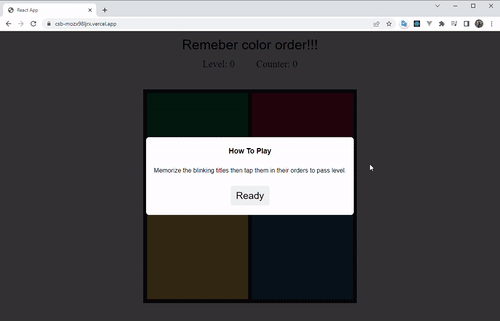

# Simon Game

At a boring Sunday, I just want to build something fun with my Frontend skill, so WOALA! I made a Simon Game using ReactJS.

You can play it [here](https://csb-mozx98ljrx.vercel.app/)

## Basic Info

Get ready to watch, remember, repeat! The Simon game is the exciting electronic game of lights and sounds in which players must repeat random sequences of lights by pressing the colored pads in the correct order. It's fast-paced play, with lights and sounds that can challenge you.

## How it look

